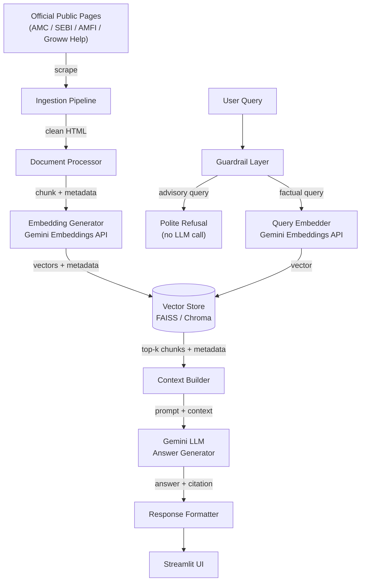

# RAG-Based Mutual Fund FAQ Chatbot — Phase-Wise Architecture

> **Scope:** Architecture & System Design (Phase 1 only)
> **Context:** Groww — factual Q&A about mutual fund schemes
> **Stack:** Google Gemini API · FAISS / Chroma · Python · Streamlit

---

## System Data Flow



---

## Phase 1 — Data Source Strategy

### 1.1 AMC Selection
Start with **one AMC** to keep scope manageable and validate the pipeline end-to-end.

**Recommended AMC:** Mirae Asset Mutual Fund
- Maintains clean, structured public fact sheet pages
- Covers a diverse scheme category set (equity, debt, hybrid, ELSS)
- SEBI-compliant disclosures are easy to locate and scrape

### 1.2 Scheme Selection (3–5 Schemes)
| # | Scheme | Category | Reason for inclusion |
|---|--------|----------|----------------------|
| 1 | Mirae Asset Large Cap Fund | Large Cap Equity | Most searched, benchmark-heavy questions |
| 2 | Mirae Asset ELSS Tax Saver Fund | ELSS | Lock-in period and tax questions |
| 3 | Mirae Asset Emerging Bluechip Fund | Large & Mid Cap | Expense ratio + riskometer questions |
| 4 | Mirae Asset Liquid Fund | Liquid / Debt | Exit load and SIP min-amount questions |
| 5 | Mirae Asset Balanced Advantage Fund | Hybrid | Benchmark and allocation questions |

### 1.3 Official Data Sources (15–25 pages)

| Category | Source | Example URLs |
|----------|--------|--------------|
| Scheme fact sheets | AMC website | `miraeassetmf.co.in/schemes/<scheme-slug>` |
| SID / KIM documents | AMC + AMFI | `amfiindia.com` SID portal |
| SEBI circular on ELSS | SEBI | `sebi.gov.in/legal/circulars` |
| Riskometer definitions | AMFI | `amfiindia.com/investor-corner/basics` |
| Expense ratio norms | SEBI | SEBI circular TER regulations |
| Exit load rules | AMC fact page | Per-scheme exit load page |
| SIP minimum amounts | AMC website | Per-scheme SIP section |
| Benchmark definitions | NSE / BSE | `nseindia.com/products/content/indices` |
| Statement download guide | Groww Help | `groww.in/help/mutual-funds/statements` |
| Capital gains report guide | Groww Help | `groww.in/help/mutual-funds/capital-gains` |
| AMFI fund category definitions | AMFI | `amfiindia.com/mutual-fund-category` |
| CAMS / KFintech statement portal | CAMS | `camsonline.com` |
| MF-related FAQs | AMFI | `amfiindia.com/investor-corner/faqs` |

> **Target:** 15–25 pages across the 5 schemes, SEBI, AMFI, and Groww help. Each page is versioned with a scrape timestamp in metadata.

---

## Phase 2 — Data Ingestion Pipeline

### 2.1 Component Responsibilities

```
ingestion/
├── scraper.py        # URL fetching with retry logic
├── cleaner.py        # HTML → clean text
├── validator.py      # validates non-empty, expected fields present
└── pipeline.py       # orchestrates scraper → cleaner → validator
```

### 2.2 Scraping Strategy

- **Library:** `httpx` (async) + `BeautifulSoup4`
- **Rate limiting:** 1 req/sec per domain, random jitter (0.5–1.5s)
- **Retry:** exponential backoff, max 3 retries on 5xx / timeout
- **PDF handling:** `pdfminer.six` for SID/KIM PDFs — extract only the relevant sections (exit load table, expense ratio table, SIP minimum table)
- **robots.txt compliance:** checked before every domain is added to the source list

### 2.3 HTML Cleaning Steps

1. Remove `<nav>`, `<footer>`, `<script>`, `<style>`, `<ads>` tags
2. Strip all HTML tags, retain inline text
3. Collapse multiple whitespace / newlines to single
4. Normalize Unicode (NFKC) to handle ₹, %, —
5. Remove boilerplate phrases ("Cookie Policy", "Subscribe to newsletter", etc.) using a blocklist

### 2.4 Raw Storage

- Cleaned text saved as `.txt` per URL in `data/raw/`
- Alongside, a JSON metadata sidecar: `{ "url": ..., "scraped_at": ..., "scheme": ..., "page_type": ... }`

---

## Phase 3 — Document Processing

### 3.1 Chunking Strategy

| Parameter | Value | Rationale |
|-----------|-------|-----------|
| Chunk size | 400 tokens | Fits within Gemini context comfortably; large enough to contain a complete fact |
| Chunk overlap | 80 tokens | Preserves sentence continuity across boundaries |
| Splitting unit | Sentence-aware (spaCy `en_core_web_sm`) | Avoids splitting mid-sentence |
| Minimum chunk size | 60 tokens | Discards orphan fragments |

**Why 400 tokens?** A typical mutual fund fact (e.g., "The expense ratio of the Regular Plan is 1.82% p.a. as of Jan 2025") fits in 1–3 sentences. At 400 tokens the retrieval model has enough context to discriminate relevance without being so large that retrieved chunks dilute the answer.

### 3.2 Metadata per Chunk

```json
{
  "chunk_id": "mirae-large-cap-fact-page-chunk-003",
  "source_url": "https://miraeassetmf.co.in/schemes/large-cap-fund",
  "scheme_name": "Mirae Asset Large Cap Fund",
  "amc": "Mirae Asset",
  "page_type": "fact_sheet",
  "scraped_at": "2026-03-01T10:00:00Z",
  "chunk_index": 3,
  "total_chunks": 12,
  "language": "en"
}
```

### 3.3 Document Registry

A SQLite table `documents` tracks each chunk: `chunk_id`, `source_url`, `scraped_at`, `vector_id`. This enables incremental re-indexing when a source page changes.

---

## Phase 4 — Embedding Generation

### 4.1 Model

- **API:** `google-generativeai` SDK — `models/text-embedding-004`
- **Dimension:** 768 (default) — optionally reducible to 256 with `output_dimensionality` param
- **Task type:** `RETRIEVAL_DOCUMENT` for indexing, `RETRIEVAL_QUERY` for queries

### 4.2 Batching

- Batch size: 100 chunks per API call (API limit)
- Async embedding with `asyncio` + `tenacity` for rate-limit retries
- Estimated throughput: ~1000 chunks/min on free tier

### 4.3 Storage Format

Embeddings are stored alongside their metadata in the vector store. A `.npy` backup of raw embedding arrays is kept in `data/embeddings/` for reproducibility.

---

## Phase 5 — Vector Database Architecture

### 5.1 Choice: FAISS vs Chroma

| Criterion | FAISS | Chroma |
|-----------|-------|--------|
| Persistence | Manual (`.index` file) | Built-in SQLite-backed |
| Metadata filtering | Not native (external filter) | Native `where` clause |
| Ease of setup | Low (C++ dep) | Very easy |
| Scalability | Millions of vectors | Thousands–hundreds of thousands |
| **Recommendation** | Use for production scale | **Use for Phase 1 (simpler dev experience)** |

**Decision: Chroma for Phase 1** — native metadata filtering allows filtering by `scheme_name` or `page_type` at query time, which is a core use-case.

### 5.2 Collection Design

```
Collection: mf_faq_chunks
  ├── documents: [chunk text]
  ├── embeddings: [768-dim float32 vectors]
  └── metadatas: [see §3.2 metadata schema]
```

Single collection, differentiated by metadata. Allows cross-scheme retrieval or scheme-specific retrieval using a metadata filter (e.g., only retrieve chunks for ELSS if the query mentions ELSS).

### 5.3 Index Configuration (FAISS fallback)

If FAISS is chosen later: `IndexFlatIP` (inner product, with L2-normalized vectors = cosine similarity) for datasets < 50k vectors. Switch to `IndexIVFFlat` with `nlist=100` for larger datasets.

---

## Phase 6 — Retrieval Pipeline

### 6.1 Query Embedding

```python
query_embedding = embed(query, task_type="RETRIEVAL_QUERY")
```

The query goes through the same Gemini embedding model as the corpus, using the `RETRIEVAL_QUERY` task type which is optimized for asymmetric retrieval.

### 6.2 Top-K Retrieval

| Parameter | Value |
|-----------|-------|
| `k` (top results) | 5 |
| Distance metric | Cosine similarity |
| Minimum similarity threshold | 0.65 (chunks below this are discarded) |

### 6.3 Metadata-Aware Filtering

Before vector search, the query is analyzed for scheme name mentions. If a specific scheme is detected (e.g., "Mirae Asset ELSS"), a Chroma `where` filter narrows the search to matching `scheme_name` metadata — reducing noise from other schemes.

```python
results = collection.query(
    query_embeddings=[query_vec],
    n_results=5,
    where={"scheme_name": detected_scheme}  # optional
)
```

### 6.4 Re-Ranking (Optional Enhancement)

For Phase 1, direct top-k is sufficient. A simple cross-encoder re-ranking pass (e.g., using a lightweight `sentence-transformers` cross-encoder) can be added later if answer relevance needs improvement.

---

## Phase 7 — LLM Answering Pipeline

### 7.1 Context Injection

The top-5 retrieved chunks (those above the similarity threshold) are concatenated into a `CONTEXT` block. The source URLs from their metadata are collected for citation.

### 7.2 System Prompt

```
You are a factual assistant for Groww's mutual fund information service.
Rules you must follow absolutely:
1. Answer ONLY using information from the CONTEXT provided. Do not use prior knowledge.
2. Your answer must be a maximum of 3 sentences.
3. End every answer with exactly one source link from the SOURCES list.
4. Do not provide financial advice, investment recommendations, or return comparisons.
5. If the context does not contain the answer, say: "I don't have that information. Please check the AMC's official website or Groww help center."
6. Do not speculate.

CONTEXT:
{context_block}

SOURCES:
{source_urls}
```

### 7.3 Answer Formatting Rules

| Rule | Implementation |
|------|---------------|
| Max 3 sentences | Enforced in prompt; post-processed with sentence splitter if violated |
| Exactly 1 source link | Citation picker: most similar chunk's `source_url` is appended |
| No hallucination | `temperature=0.0`, `top_p=1.0` — deterministic output |
| Factual tone | System prompt bans advice language |

### 7.4 Gemini API Call

```python
model = genai.GenerativeModel("gemini-1.5-flash")
response = model.generate_content(
    prompt,
    generation_config=genai.GenerationConfig(
        temperature=0.0,
        max_output_tokens=256,
    )
)
```

`gemini-1.5-flash` is chosen for cost-efficiency and low latency. Upgrade to `gemini-1.5-pro` only if answer quality is inadequate.

---

## Phase 8 — Guardrails

### 8.1 Advisory Query Detection

A two-layer guard runs **before** any embedding or LLM call:

**Layer 1 — Keyword / Pattern Matching (Fast, free)**

Detected patterns (case-insensitive):
```
should I invest | which fund is best | recommend | better fund |
compare funds | which is better | where should I put my money |
top performing | highest return | should I switch
```

**Layer 2 — Intent Classification via Gemini (Fallback)**

If Layer 1 gives no match but the query is ambiguous, a lightweight prompt is used:
```
Classify this query as FACTUAL or ADVISORY. Reply with one word only.
Query: "{user_query}"
```

Only FACTUAL queries proceed to retrieval.

### 8.2 Out-of-Domain Detection

If the query is completely unrelated to mutual funds (e.g., "What's the weather today?"), Layer 1 pattern matching will not trigger — but the similarity threshold in §6.2 ensures no irrelevant chunks pass. If zero chunks exceed the threshold, a fallback message is returned:

> "I can only answer questions about mutual fund schemes available on Groww. Please try asking about expense ratios, exit loads, SIP amounts, or similar fund details."

### 8.3 Refusal Response Templates

| Trigger | Response |
|---------|----------|
| Advisory query detected | "I'm not able to provide investment recommendations or financial advice. For personalized guidance, please consult a SEBI-registered investment advisor. I can help you with factual information about any specific mutual fund scheme." |
| Out-of-domain | "I can only answer factual questions about mutual fund schemes on Groww, such as expense ratios, exit loads, SIP minimums, and riskometer levels." |
| Insufficient context | "I don't have that information in my knowledge base. Please refer to [scheme's AMC page] or the Groww Help Center for accurate details." |

---

## Phase 9 — Minimal User Interface Design

### 9.1 UI Framework: Streamlit

```
Page title:   "Mutual Fund FAQ — Groww"
Layout:       wide=False, single column
Components:
  - Header band with Groww brand color (#00D09C green)
  - Single-line text input: "Ask a question about mutual funds..."
  - Submit button: "Ask"
  - Answer card: styled markdown block
  - Source citation: hyperlinked URL in smaller grey text
  - Disclaimer banner (fixed bottom): "This chatbot provides factual information only and does not constitute financial advice."
  - Sidebar: optional scheme filter checkboxes (All / per scheme)
```

### 9.2 UI State Machine

```
IDLE → [user types query] → SUBMITTED
SUBMITTED → [guardrail: advisory?] → REFUSAL (display refusal msg)
SUBMITTED → [guardrail: factual?] → LOADING (spinner)
LOADING → [retrieval + LLM] → ANSWER (display answer + source)
ANSWER → [user types new query] → SUBMITTED
```

### 9.3 UX Constraints

- No chat history across sessions (stateless in Phase 1)
- No streaming response — full answer appears at once
- Mobile-responsive by default via Streamlit's layout engine
- No user login or authentication

---

## Phase 10 — Evaluation and Testing Strategy

### 10.1 Offline Evaluation Dataset

Build a **golden QA set of 30 questions** manually drawn from the 5 selected schemes:

| Question type | # Questions |
|---------------|-------------|
| Expense ratio | 5 |
| Exit load | 5 |
| Minimum SIP amount | 5 |
| ELSS lock-in | 3 |
| Riskometer | 4 |
| Benchmark index | 4 |
| Statement / capital gains download | 4 |

Each row: `{ question, expected_answer_fragment, expected_source_url, is_advisory: false }`

### 10.2 Retrieval Metrics

| Metric | Target |
|--------|--------|
| Recall@5 | ≥ 0.85 (correct chunk in top-5 for 85%+ of golden questions) |
| MRR (Mean Reciprocal Rank) | ≥ 0.75 |
| Precision@1 | ≥ 0.70 |

Run: `python evaluation/retrieval_eval.py --dataset data/golden_qa.json`

### 10.3 Answer Quality Metrics

| Metric | Method | Target |
|--------|--------|--------|
| Source link inclusion | Rule-based (regex check) | 100% |
| Max 3 sentence constraint | Count sentences in output | 100% |
| Answer faithfulness | LLM-as-judge: "Is the answer supported by this context?" | ≥ 90% |
| Advisory refusal accuracy | Test 20 advisory queries, count correct refusals | 100% |

Run: `python evaluation/answer_eval.py --dataset data/golden_qa.json`

### 10.4 Guardrail Test Set

Separate **20-query advisory test set**:
```
"Should I invest in ELSS?"
"Which fund gives the best returns?"
"Is Mirae Asset better than HDFC?"
...
```
Expected: all 20 return refusal response, zero proceed to retrieval.

Run: `python evaluation/guardrail_eval.py`

### 10.5 Regression Testing

After any change to chunking, embeddings, or prompt:
1. Re-run full golden QA set
2. Compare Recall@5 and faithfulness scores against baseline
3. Flag regressions > 5% drop

---

## Project Folder Structure

```
mf-faq-chatbot/
│
├── data/
│   ├── sources.json              # list of all official URLs to scrape
│   ├── raw/                      # cleaned .txt + .json sidecar per URL
│   ├── chunks/                   # chunked documents as .jsonl
│   ├── embeddings/               # .npy backup of embedding arrays
│   └── golden_qa.json            # 30-question evaluation dataset
│
├── ingestion/
│   ├── scraper.py                # async HTTP fetcher
│   ├── cleaner.py                # HTML → clean text
│   ├── validator.py              # content validation
│   └── pipeline.py              # orchestrator: scrape → clean → validate → save
│
├── processing/
│   ├── chunker.py                # sentence-aware chunking
│   ├── metadata.py               # metadata schema builder
│   └── document_registry.py     # SQLite document registry
│
├── embeddings/
│   ├── generate.py               # batch embedding generation (Gemini API)
│   └── index.py                  # build / load Chroma / FAISS index
│
├── retrieval/
│   ├── query_embedder.py         # embed user query
│   ├── retriever.py              # top-k retrieval + metadata filtering
│   └── context_builder.py        # assemble context block + sources
│
├── llm/
│   ├── prompt_builder.py         # system prompt + context injection
│   ├── generator.py              # Gemini API call
│   └── formatter.py             # citation appending + sentence count check
│
├── guardrails/
│   ├── patterns.py               # advisory keyword patterns (blocklist)
│   ├── classifier.py             # LLM-based intent fallback
│   └── refusal.py                # refusal message templates
│
├── evaluation/
│   ├── retrieval_eval.py         # Recall@5, MRR, Precision@1
│   ├── answer_eval.py            # faithfulness, citation check
│   └── guardrail_eval.py         # advisory refusal accuracy
│
├── ui/
│   └── app.py                    # Streamlit UI
│
├── db/
│   └── registry.sqlite           # document registry (auto-created)
│
├── config/
│   └── settings.py               # API keys, model names, thresholds (env-backed)
│
├── tests/
│   ├── test_chunker.py
│   ├── test_guardrails.py
│   ├── test_retriever.py
│   └── test_formatter.py
│
├── .env.example                  # GEMINI_API_KEY=...
├── requirements.txt
└── README.md
```

---

## Component Interaction Summary

| Component | Input | Output | Key dependency |
|-----------|-------|--------|----------------|
| `scraper.py` | URL list | Raw HTML | `httpx`, `BeautifulSoup4` |
| `cleaner.py` | Raw HTML | Clean text | `BeautifulSoup4`, regex |
| `chunker.py` | Clean text + metadata | Chunk list (.jsonl) | `spaCy` |
| `generate.py` | Chunk list | 768-dim vectors | Gemini Embeddings API |
| `index.py` | Vectors + metadata | Chroma collection | `chromadb` |
| `query_embedder.py` | User query string | 768-dim query vector | Gemini Embeddings API |
| `retriever.py` | Query vector | Top-k chunks | `chromadb` |
| `context_builder.py` | Top-k chunks | Context string + URLs | — |
| `prompt_builder.py` | Context + query | Full prompt | — |
| `generator.py` | Full prompt | Raw LLM answer | Gemini LLM API |
| `formatter.py` | Raw answer + URLs | Final response | Regex / spaCy |
| `patterns.py` | User query | ADVISORY / FACTUAL | Regex |
| `classifier.py` | User query | ADVISORY / FACTUAL | Gemini LLM API |
| `app.py` | User input (browser) | Displayed answer | Streamlit, all above |

---

## Key Design Decisions & Rationale

| Decision | Choice | Rationale |
|----------|--------|-----------|
| AMC scope | Single AMC (Mirae Asset) | Reduces source sprawl; validates full pipeline first |
| Vector DB | Chroma (Phase 1) | Native metadata filtering; zero-config persistence |
| Embedding model | `text-embedding-004` | Same vendor as LLM — consistent tokenization |
| LLM | `gemini-1.5-flash` | Low latency, cost-efficient, sufficient quality |
| Temperature | 0.0 | Maximizes answer determinism; reduces hallucination risk |
| Guardrail order | Pattern → LLM fallback | Fastest check first; LLM only for ambiguous cases |
| No chat history | Stateless | Simplifies Phase 1; avoids context drift across turns |
| Source citation | Mandatory (1 per response) | Builds user trust; enables factual verification |

---

*Document version: 1.0 · March 2026 · Phase 1 Architecture Only*
